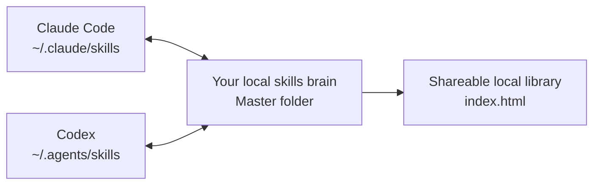

# SkillMaster

Say goodbye to copying .md skill files from Codex to Claude or vice versa. With SkillMaster, you can create a skill once, and it will sync to Claude and Codex. SkillMaster also creates a local folder that stores all of your skills — complete with your own website for all of your skills (as an .html file), so that you can easily browse, copy, and share your skills anywhere. 

## The Value

| Without SkillMaster | With SkillMaster |
| --- | --- |
| Skills live in separate tool folders. | Every skill is collected in one local master folder. |
| A skill created in Claude is not automatically available in Codex. | Claude Code and Codex stay synced automatically. |
| Sharing a skill means hunting through files. | Open `index.html`, click `Copy`, paste anywhere. |
| Your best workflows are scattered. | Your skills become a living brain that grows with you. |

## What It Does



SkillMaster watches three places:

| Place | Purpose |
| --- | --- |
| Claude Code skills | Where Claude Code reads skills. |
| Codex skills | Where Codex reads skills. |
| Your master folder | Your private source of truth for all skills. |

When you add or edit a skill in any of those places, SkillMaster syncs the change everywhere else. Create a skill anywhere, sync it everywhere. 

## Why This Matters

Your skills are not just files. They are reusable workflows, preferences, operating procedures, and hard-won context.

SkillMaster turns them into a local system:

1. Create skills naturally while working in Claude Code or Codex.
2. Let SkillMaster collect and sync them automatically.
3. Build up one durable folder that represents how you work.
4. Open `index.html` when you want to inspect, copy, or share a skill.

## What You Get

| Feature | What It Means |
| --- | --- |
| Automatic Claude ↔ Codex sync | Create or edit a skill in either tool and the other gets it. |
| Local master folder | All your skills live in one private folder on your machine. |
| Generated `index.html` | A clean local website showing every skill. |
| One-click copy | Copy the full `SKILL.md` and paste it into chat, docs, email, or another machine. |
| Background watcher | Sync happens automatically after setup. |
| Conservative deletes | Deleting from a tool folder does not destroy your master copy. |

## The Skill Format

A skill is a folder with a `SKILL.md` file:

```text
my-skill/
└── SKILL.md
```

Example:

```markdown
---
name: my-skill
description: Use this when the user wants this reusable workflow.
---

# My Skill

Instructions for the agent go here.
```

## Install

### 1. Clone SkillMaster

If you do not already have the repo:

```bash
git clone https://github.com/richling98/skillmaster.git
cd skillmaster
```

If you already cloned it:

```bash
cd path/to/skillmaster
```

### 2. Run Setup

```bash
./setup.sh
```

Setup asks where your master skills folder should live.

```text
Where should your master skills folder live?
Default: /Users/you/skills
- Press Enter to use the default.
- Or paste the full absolute filepath to the folder you want to use.
>
```

| What You Want | What To Do |
| --- | --- |
| Use the default folder | Press Enter. |
| Use a different folder | Paste the full absolute path, such as `/Users/you/Documents/skills`. |

Do not type `default`. Do not type a relative path like `skills`.

### 3. Open Your Skills Library

Setup prints the path:

```text
Skill library: /path/to/your/skills/index.html
```

Open that file in your browser.

On macOS:

```bash
source ~/.skillmaster/config
open "$MASTER_DIR/index.html"
```

## What Setup Creates

| Path | What It Is |
| --- | --- |
| Your chosen master folder | Local source of truth for every skill. |
| `~/.claude/skills` | Claude Code skill folder. |
| `~/.agents/skills` | Codex skill folder. |
| `~/.skillmaster/config` | SkillMaster configuration. |
| `~/.skillmaster/runtime/scripts` | Runtime copy used by the background watcher. |
| `$MASTER_DIR/index.html` | Local website for browsing and copying skills. |

## Daily Use

### Create Or Edit Skills Normally

Create or edit a skill in any of these places:

```text
$MASTER_DIR/<skill-name>/SKILL.md
~/.claude/skills/<skill-name>/SKILL.md
~/.agents/skills/<skill-name>/SKILL.md
```

SkillMaster syncs the change to the other locations.

### Share A Skill

1. Open `$MASTER_DIR/index.html`.
2. Search for the skill.
3. Click `Copy`.
4. Paste the skill wherever you want.

## Sync Rules

| Action | Result |
| --- | --- |
| Add/edit in Claude Code | Syncs to Codex and master folder. |
| Add/edit in Codex | Syncs to Claude Code and master folder. |
| Add/edit in master folder | Syncs to Claude Code and Codex. |
| Delete from master folder | Deletes tool copies. |
| Delete from Claude or Codex | Master copy is preserved. |
| Update `index.html` | Ignored by watcher to avoid loops. |

## Configuration

SkillMaster writes config here:

```text
~/.skillmaster/config
```

Example:

```bash
MASTER_DIR="$HOME/skills"
CLAUDE_SKILLS_DIR="$HOME/.claude/skills"
CODEX_SKILLS_DIR="$HOME/.agents/skills"
LOG_FILE="$HOME/.skillmaster/sync.log"
EXCLUDED_SKILLS="skill-creator,gstack"
DEBOUNCE_SECONDS="0.5"
```

If you move folders, edit this file and restart the watcher.

macOS:

```bash
launchctl unload "$HOME/Library/LaunchAgents/com.skillmaster.watcher.plist"
launchctl load "$HOME/Library/LaunchAgents/com.skillmaster.watcher.plist"
```

Linux:

```bash
systemctl --user restart skillmaster.service
```

## Commands

| Command | Use It For |
| --- | --- |
| `./setup.sh` | Guided install. |
| `scripts/bootstrap.sh` | Import existing Claude/Codex skills into master. |
| `scripts/sync.sh` | Push master skills to Claude Code and Codex. |
| `scripts/sync.sh my-skill` | Sync one skill. |
| `scripts/sync.sh --dry-run` | Preview sync without changing files. |
| `scripts/generate-index.sh` | Rebuild `index.html`. |
| `scripts/watch.sh` | Run watcher in foreground for debugging. |
| `scripts/install-watcher.sh` | Install or reinstall the background watcher. |
| `scripts/uninstall.sh` | Remove SkillMaster support files and services. |

## Verify It Works

Check watcher health on macOS:

```bash
launchctl print gui/$(id -u)/com.skillmaster.watcher | grep -E "state =|last exit code|pid ="
wc -l ~/.skillmaster/state/watch-state.previous
tail -n 20 ~/.skillmaster/sync.log
```

Good signs:

| Check | Expected |
| --- | --- |
| Watcher state | `state = running` |
| Last exit code | `(never exited)` |
| State file count | Nonzero |
| Log | Recent watcher or sync messages |

Manual sync test:

```bash
source ~/.skillmaster/config
mkdir -p "$MASTER_DIR/manual-master-test"
cat > "$MASTER_DIR/manual-master-test/SKILL.md" <<'EOF'
---
name: manual-master-test
description: Manual test skill created in the master folder.
---

# Manual Master Test

This skill verifies master-to-tool sync.
EOF
```

Wait 5-10 seconds:

```bash
test -f "$HOME/.claude/skills/manual-master-test/SKILL.md" && echo "Claude copy exists"
test -f "$HOME/.agents/skills/manual-master-test/SKILL.md" && echo "Codex copy exists"
```

## Troubleshooting

### Watcher Is Not Syncing

```bash
cat ~/.skillmaster/config
tail -n 100 ~/.skillmaster/sync.log
tail -n 100 ~/.skillmaster/watcher.err.log
```

Confirm the watcher can see your skills:

```bash
~/.skillmaster/runtime/scripts/watch.sh --scan-state /tmp/skillmaster-state.txt
wc -l /tmp/skillmaster-state.txt
head /tmp/skillmaster-state.txt
```

If the count is `0`, check the paths in `~/.skillmaster/config`.

### `index.html` Is Stale

```bash
source ~/.skillmaster/config
scripts/generate-index.sh "$MASTER_DIR"
```

Refresh the browser tab.

### Copy Button Does Not Work

Some browsers restrict clipboard access for local files.

Fallback:

1. Click `View skill`.
2. Select the visible markdown.
3. Copy manually.

## Uninstall

```bash
scripts/uninstall.sh
```

Non-interactive:

```bash
scripts/uninstall.sh --yes
```

Uninstall removes SkillMaster support files and services. It preserves your master skills folder by default.

## Privacy

| Topic | Behavior |
| --- | --- |
| Uploads | SkillMaster does not upload skills anywhere. |
| Generated page | `index.html` is local. |
| Clipboard | Copy writes only to your clipboard. |
| Public repo | This repo contains tooling, not your private skills. |
| Backups | Use a separate private repo or private synced folder if desired. |

## Developer Checks

```bash
bash -n setup.sh scripts/*.sh tests/run.sh
tests/run.sh
```

The tests use temporary fake folders. They do not touch your real skills.
