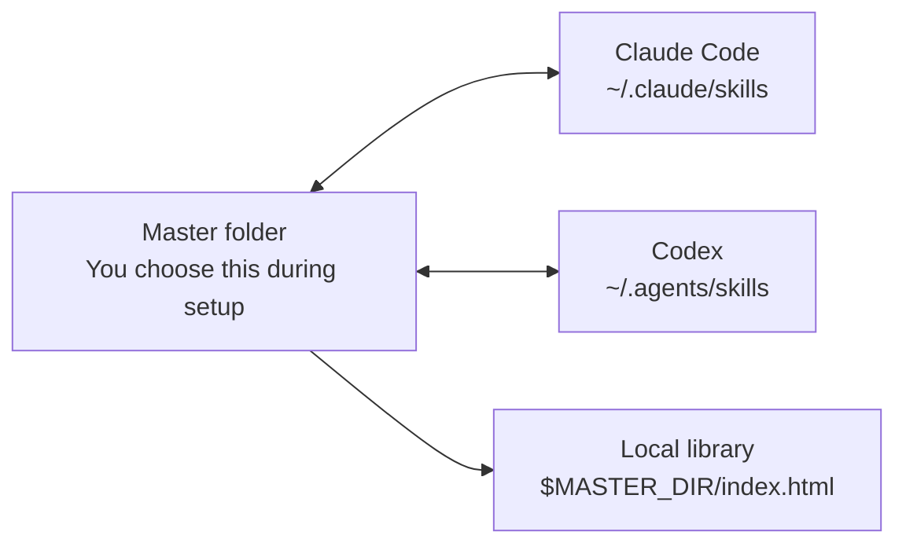

# SkillMaster

SkillMaster gives you one private, local home for reusable AI skills.

It keeps your chosen master skills folder in sync with Claude Code and Codex, and it generates a local `index.html` library where you can search, inspect, and copy any skill as raw markdown.

> Your skills stay on your computer. This repo is only the tooling.

## At A Glance

| Question | Answer |
| --- | --- |
| What is it? | A local skill manager for AI agent workflows. |
| Who is it for? | People who use reusable `SKILL.md` instructions across Claude Code, Codex, and other surfaces. |
| What does it sync? | Skill folders that contain a `SKILL.md` file. |
| Where is the source of truth? | The master folder you choose during setup. |
| Does it upload my skills? | No. Everything is local unless you separately put your master folder in a private repo or synced drive. |
| Does it include a browser UI? | It generates a static local `index.html` file inside your master folder. |
| Does it need a server? | No. Open the generated HTML file directly. |

## What You Get

| Feature | What It Does |
| --- | --- |
| Master skills folder | One durable local folder where your skills live. |
| Claude Code sync | Keeps `~/.claude/skills` current. |
| Codex sync | Keeps `~/.agents/skills` current. |
| Background watcher | Automatically notices skill changes and syncs them. |
| Local skill library | Generates `$MASTER_DIR/index.html` with search, preview, and copy buttons. |
| Copy-anywhere workflow | Copy the full `SKILL.md` and paste it into chat, email, docs, or another agent surface. |
| Safety around deletes | Tool-side deletes do not delete the master copy. |
| Setup script | Imports existing skills, writes config, generates the library, and installs the watcher. |

## How It Works

SkillMaster coordinates three folders:



The folder you choose during setup is the private source of truth. SkillMaster imports existing Claude Code and Codex skills into it, then keeps all three locations aligned.

## The Skill Shape

Each skill is just a folder with a `SKILL.md` file:

```text
my-skill/
└── SKILL.md
```

A typical skill looks like this:

```markdown
---
name: my-skill
description: Use this when the user wants this reusable workflow.
---

# My Skill

Instructions for the agent go here.
```

Your generated library lives next to your skills:

```text
$MASTER_DIR/
├── index.html
├── my-skill/
│   └── SKILL.md
└── another-skill/
    └── SKILL.md
```

## Install

### Prerequisites

SkillMaster is intentionally small. On a normal macOS or Linux development machine, you should already have what you need.

| Requirement | Why It Is Needed |
| --- | --- |
| `bash` | Runs the setup and sync scripts. |
| `git` | Clones this repo. |
| Standard Unix tools | Uses `cp`, `find`, `awk`, `sed`, `cksum`, and `stat`. |
| macOS `launchd` or Linux `systemd --user` | Runs the background watcher. |

The installed watcher uses polling mode by default, so normal setup does **not** require `fswatch`, Homebrew, `inotifywait`, or `apt`.

### Step 1: Clone The Repo

If you do not already have the repo:

```bash
git clone https://github.com/richling98/skillmaster.git
cd skillmaster
```

If you already cloned it, go to that folder instead:

```bash
cd path/to/skillmaster
```

### Step 2: Run Setup

```bash
./setup.sh
```

Setup asks:

```text
Where should your master skills folder live?
Default: /Users/you/skills
- Press Enter to use the default.
- Or paste the full absolute filepath to the folder you want to use.
>
```

Use one of these two answers:

| What You Want | What To Type |
| --- | --- |
| Use the default folder | Press Enter. |
| Use a custom folder | Paste the full absolute filepath, such as `/Users/you/Documents/skills`. |

Do **not** type `default`. Do **not** type a relative path such as `skills`.

If the path is invalid, setup explains the issue and asks again.

### Step 3: Open The Library

After setup finishes, it prints the path to your generated library:

```text
Skill library: /path/to/your/skills/index.html
```

Open that file in your browser.

On macOS:

```bash
source ~/.skillmaster/config
open "$MASTER_DIR/index.html"
```

## What Setup Does

`setup.sh` performs the full install:

| Step | Action |
| --- | --- |
| 1 | Creates your master folder if needed. |
| 2 | Creates Claude Code and Codex skill folders if needed. |
| 3 | Writes config to `~/.skillmaster/config`. |
| 4 | Imports existing skills from Claude Code and Codex. |
| 5 | Skips configured built-in/system skills. |
| 6 | Generates `$MASTER_DIR/index.html`. |
| 7 | Installs the bundled `add-new-skill` helper skill. |
| 8 | Installs the background watcher unless `--no-service` is used. |
| 9 | Prints the important paths. |

The watcher runs from a copied runtime folder:

```text
~/.skillmaster/runtime/scripts/
```

This avoids macOS background-service permission issues when the repo itself lives under protected locations such as `~/Documents`.

## Daily Use

### Add A New Skill

Create a folder in your master directory:

```bash
source ~/.skillmaster/config
mkdir -p "$MASTER_DIR/my-new-skill"
```

Then add:

```text
$MASTER_DIR/my-new-skill/SKILL.md
```

The watcher syncs it to Claude Code and Codex automatically.

### Edit A Skill

Edit the master copy:

```text
$MASTER_DIR/<skill-name>/SKILL.md
```

Within a few seconds, SkillMaster updates:

```text
~/.claude/skills/<skill-name>/SKILL.md
~/.agents/skills/<skill-name>/SKILL.md
$MASTER_DIR/index.html
```

### Copy A Skill

Open:

```text
$MASTER_DIR/index.html
```

Use search to find the skill, then click `Copy`.

That copies the full raw `SKILL.md`, ready to paste anywhere.

## Sync Rules

| Change | Result |
| --- | --- |
| Add skill in master | Syncs to Claude Code and Codex. |
| Edit skill in master | Syncs to Claude Code and Codex. |
| Add/edit skill in Claude Code | Syncs to master and Codex. |
| Add/edit skill in Codex | Syncs to master and Claude Code. |
| Delete skill from master | Deletes the Claude Code and Codex copies. |
| Delete skill from Claude Code | Logs the event; master is preserved. |
| Delete skill from Codex | Logs the event; master is preserved. |
| Regenerate `index.html` | Ignored by the watcher to avoid loops. |

SkillMaster compares checksums before copying, so a sync it performs does not bounce forever between folders.

## Configuration

SkillMaster writes:

```text
~/.skillmaster/config
```

Example:

```bash
MASTER_DIR="$HOME/skills"
CLAUDE_SKILLS_DIR="$HOME/.claude/skills"
CODEX_SKILLS_DIR="$HOME/.agents/skills"
LOG_FILE="$HOME/.skillmaster/sync.log"
EXCLUDED_SKILLS="skill-creator,gstack"
DEBOUNCE_SECONDS="0.5"
```

| Setting | Meaning |
| --- | --- |
| `MASTER_DIR` | Your private source-of-truth skills folder. |
| `CLAUDE_SKILLS_DIR` | Claude Code skills folder. |
| `CODEX_SKILLS_DIR` | Codex skills folder. |
| `LOG_FILE` | Sync and watcher activity log. |
| `EXCLUDED_SKILLS` | Comma-separated skill names to skip. |
| `DEBOUNCE_SECONDS` | Short wait before syncing after a file event. |

If you edit config, restart the watcher.

macOS:

```bash
launchctl unload "$HOME/Library/LaunchAgents/com.skillmaster.watcher.plist"
launchctl load "$HOME/Library/LaunchAgents/com.skillmaster.watcher.plist"
```

Linux:

```bash
systemctl --user restart skillmaster.service
```

## Commands

| Command | Purpose |
| --- | --- |
| `./setup.sh` | Guided install. |
| `scripts/bootstrap.sh` | Import existing Claude/Codex skills into master. |
| `scripts/sync.sh` | Push master skills to Claude Code and Codex. |
| `scripts/sync.sh my-skill` | Sync one skill from master. |
| `scripts/sync.sh --dry-run` | Preview sync actions without writing files. |
| `scripts/generate-index.sh` | Regenerate `$MASTER_DIR/index.html`. |
| `scripts/watch.sh` | Run watcher in the foreground for debugging. |
| `scripts/install-watcher.sh` | Install/reinstall the background watcher. |
| `scripts/uninstall.sh` | Remove SkillMaster support files and services. |

## Non-Interactive Install

Use this for scripting or repeatable tests:

```bash
./setup.sh \
  --non-interactive \
  --master "$HOME/skills" \
  --claude "$HOME/.claude/skills" \
  --codex "$HOME/.agents/skills"
```

Skip the background watcher:

```bash
./setup.sh --non-interactive --master "$HOME/skills" --no-service
```

## Verify It Works

### Quick Health Check

macOS:

```bash
launchctl print gui/$(id -u)/com.skillmaster.watcher | grep -E "state =|last exit code|pid ="
wc -l ~/.skillmaster/state/watch-state.previous
tail -n 20 ~/.skillmaster/sync.log
```

Expected:

| Check | Good Output |
| --- | --- |
| Watcher state | `state = running` |
| Last exit code | `(never exited)` |
| State file count | A nonzero number |
| Log | Recent sync or watcher startup messages |

### Manual End-To-End Test

```bash
source ~/.skillmaster/config
mkdir -p "$MASTER_DIR/manual-master-test"
cat > "$MASTER_DIR/manual-master-test/SKILL.md" <<'EOF'
---
name: manual-master-test
description: Manual test skill created in the master folder.
---

# Manual Master Test

This skill verifies master-to-tool sync.
EOF
```

Wait 5-10 seconds, then check:

```bash
test -f "$HOME/.claude/skills/manual-master-test/SKILL.md" && echo "Claude copy exists"
test -f "$HOME/.agents/skills/manual-master-test/SKILL.md" && echo "Codex copy exists"
```

Open `$MASTER_DIR/index.html` and confirm `manual-master-test` appears.

## Generated Library Page

The generated `index.html` is a static local file.

It includes:

| UI Element | Purpose |
| --- | --- |
| Search | Filters skills by name and description. |
| Skill cards | One row per skill. |
| Description | Reads from YAML frontmatter when present. |
| Updated timestamp | Shows the `SKILL.md` modified time. |
| View skill | Expands the full markdown. |
| Copy | Copies the full raw `SKILL.md`. |

Clipboard behavior uses `navigator.clipboard.writeText()` with a fallback for stricter local-file browser permissions.

## Troubleshooting

### The Watcher Is Not Syncing

Check config:

```bash
cat ~/.skillmaster/config
```

Check logs:

```bash
tail -n 100 ~/.skillmaster/sync.log
tail -n 100 ~/.skillmaster/watcher.err.log
```

Confirm the poller can see your skills:

```bash
~/.skillmaster/runtime/scripts/watch.sh --scan-state /tmp/skillmaster-state.txt
wc -l /tmp/skillmaster-state.txt
head /tmp/skillmaster-state.txt
```

If the count is `0`, check whether the paths in `~/.skillmaster/config` are correct and readable.

### The Generated Page Is Stale

Regenerate it:

```bash
source ~/.skillmaster/config
scripts/generate-index.sh "$MASTER_DIR"
```

Refresh the browser tab.

### Copy Does Not Work In The Browser

Some browsers restrict clipboard access for local files.

Fallback:

1. Click `View skill`.
2. Select the visible markdown.
3. Copy with your operating system shortcut.

### A Skill Did Not Import

Confirm the folder contains:

```text
SKILL.md
```

Then check exclusions:

```bash
grep EXCLUDED_SKILLS ~/.skillmaster/config
```

Excluded skill names are skipped by bootstrap and sync.

### You Chose The Wrong Master Folder

Edit:

```bash
~/.skillmaster/config
```

Change `MASTER_DIR`, then run:

```bash
source ~/.skillmaster/config
mkdir -p "$MASTER_DIR"
scripts/bootstrap.sh
scripts/generate-index.sh "$MASTER_DIR"
```

Restart the watcher afterward.

## Uninstall

```bash
scripts/uninstall.sh
```

Non-interactive:

```bash
scripts/uninstall.sh --yes
```

Uninstall removes SkillMaster support files and services. It preserves your master skills folder by default.

If you want to remove your master skills folder too, delete it manually only after confirming you have a backup.

## Privacy And Safety

| Topic | Behavior |
| --- | --- |
| Uploads | SkillMaster does not upload skills anywhere. |
| Generated page | `index.html` is local. |
| Clipboard | Copy button writes only to your clipboard. |
| Public repo | This repo should contain tooling, not your private skills. |
| Backups | Use a separate private repo or private synced folder if you want backup/multi-machine sync. |

## Repository Map

```text
README.md
setup.sh
scripts/
  bootstrap.sh
  common.sh
  generate-index.sh
  install-watcher.sh
  sync.sh
  uninstall.sh
  watch.sh
config/
  skillmaster.conf.example
launchd/
  com.skillmaster.watcher.plist
systemd/
  skillmaster.service
skills/
  add-new-skill/
    SKILL.md
tests/
  run.sh
plans/
  skillmaster-plan.html
```

## Developer Checks

Run syntax checks:

```bash
bash -n setup.sh scripts/*.sh tests/run.sh
```

Run integration tests:

```bash
tests/run.sh
```

The tests create temporary fake master, Claude, and Codex folders. They do not touch your real skills.
